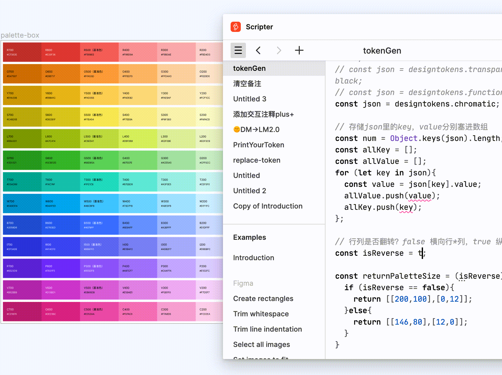

# tokenGen
从jsonbin抓取存储设计系统token的JSON代码，使用脚本快速绘制调色盘生成 Guidelines


1. 复制下面脚本代码；
2. 打开FigmaScrpter插件；
3. 点击‘+’创建新的代码片段；
4. 粘贴拷贝的代码；
5. 选择要批注的画布
6. 点击play按钮运行脚本




```javascript

const thisJSON = await fetchJson("https://api.jsonbin.io/v3/b/6431146cace6f33a2206e924")
const designtokens = thisJSON.record

// 存储designtokens里的key，value分别塞进数组
const designTokensKey = [];
const designTokensValue = [];
for (let key in designtokens){
	const value = designtokens[key].value;
	// designTokensValue.push(value);
	designTokensKey.push(key);
};
print(designTokensKey)

// const json = designtokens.neutral;
// const json = designtokens.transparency.white;
// const json = designtokens.transparency.black;
// const json = designtokens.functional;
const json = designtokens.chromatic;

// 存储json里的key，value分别塞进数组
const num = Object.keys(json).length;
const allKey = [];
const allValue = [];
for (let key in json){
	const value = json[key].value;
	allValue.push(value);
	allKey.push(key);
};

// 行列是否翻转？false 横向行*列，true 纵向行*列
const isReverse = false;

const returnPaletteSize = (isReverse) =>{
  if (isReverse == false){
    return [[200,100],[0,12]];
  }else{
    return [[146,80],[12,0]];
  }
}

const PaletteSize = returnPaletteSize(isReverse)[0];
const PaletteGrid = returnPaletteSize(isReverse)[1];
const frameWidth = PaletteSize[0];
const frameHeight = PaletteSize[1];
const gutterWidth = PaletteGrid[0];
const gutterHeight = PaletteGrid[1];

/*--------------------------------分割线--------------------------------*/

// 修改行数，调色盘容器背景色，对比度阈值
const rows = 13;
const columns = Math.ceil(num/rows);
const bgColor = 'rgba(255, 255, 255, 1)';
// const bgColor = 'rgba(0, 0, 0, 1)';
// const bgColor = 'rgba(255, 0, 0, 1)';
const txtColor ='rgba(0,0,0,1)';
const contrastRatio = 6;
const PaletteName = 'palette-box';

// 根据行列是否翻转区分计算调色盘整个容器的宽高
const returnBoxSize = (isReverse) =>{
  if (isReverse == false){
    return [(frameWidth+gutterWidth)*columns+24-gutterWidth,(frameHeight+gutterHeight)*rows+24-gutterHeight]];
  }else{
    return [(frameWidth+gutterWidth)*rows+24-gutterWidth,(frameHeight+gutterHeight)*columns+24-gutterHeight];
  }
};
// 将返回值赋值给paletteBox的宽高
const paletteBoxWidth = returnBoxSize(isReverse)[0];
const paletteBoxHeight = returnBoxSize(isReverse)[1];

// 获取混合后的颜色值
const getMixColor = (fgColor, bgColor) =>{

  const hexToRgb = (hexValue, opc) => {
    var rgx = /^#?([a-f\d])([a-f\d])([a-f\d])$/i;
    var hex = hexValue.replace(rgx, function(m, r, g, b) {
      return r + r + g + g + b + b;
    });
    var rgb = /^#?([a-f\d]{2})([a-f\d]{2})([a-f\d]{2})$/i.exec(hex);
    if(!rgb){
      return hexValue;
    }
    var r = parseInt(rgb[1], 16);
    var g = parseInt(rgb[2], 16);
    var b = parseInt(rgb[3], 16);
    return 'rgba(' + r + ',' + g + ',' + b + ',' + opc + ')';
  }


  // const toRgbColor = hexToRgb(bgColor,1);
  // print(toRgbColor)

  // 计算两个颜色融合后的色值并返回
  const mixRGBA = (fgColor, bgColor) =>{
    const fgrgbaArray = fgColor.slice(5, -1).split(',').map(element => parseFloat(element.trim()));
    const bgrgbaArray = bgColor.slice(5, -1).split(',').map(element => parseFloat(element.trim()));
    var r = Math.round(fgrgbaArray[0]*fgrgbaArray[3] + bgrgbaArray[0]*(1-fgrgbaArray[3]));
    var g = Math.round(fgrgbaArray[1]*fgrgbaArray[3] + bgrgbaArray[1]*(1-fgrgbaArray[3]));
    var b = Math.round(fgrgbaArray[2]*fgrgbaArray[3] + bgrgbaArray[2]*(1-fgrgbaArray[3]));
    
    return 'rgba(' + r + ',' + g + ',' + b + ')';
  }
  return mixRGBA(fgColor, bgColor)
}

//创建一个计算亮度的函数
const luminanace = (r, g, b) => {
    var a = [r, g, b].map(function (v) {
        v /= 255;
        return v <= 0.03928
            ? v / 12.92
            : Math.pow((v + 0.055) / 1.055, 2.4);
    });
    return a[0] * 0.2126 + a[1] * 0.7152 + a[2] * 0.0722;
}

//套入对比度计算公式
const testContrast = (bgColor, txtColor) =>{
  const bgColorArray = bgColor.slice(5, -1).split(',').map(element => parseFloat(element.trim()));

  const L1 = luminanace(bgColorArray[0],bgColorArray[1],bgColorArray[2])+0.05;
  const txtColorArray = txtColor.slice(5, -1).split(',').map(element => parseFloat(element.trim()));
  const L2 = luminanace(txtColorArray[0],txtColorArray[1],txtColorArray[2])+0.05;
  return L1/L2;
}

// 创建一个hex转 RGB方法函数
const hexToRgb = (hexValue, opc) => {
  var rgx = /^#?([a-f\d])([a-f\d])([a-f\d])$/i;
  var hex = hexValue.replace(rgx, function(m, r, g, b) {
    return r + r + g + g + b + b;
  });
  var rgb = /^#?([a-f\d]{2})([a-f\d]{2})([a-f\d]{2})$/i.exec(hex);
  if(!rgb){
    return hexValue;
  }
  var r = parseInt(rgb[1], 16);
  var g = parseInt(rgb[2], 16);
  var b = parseInt(rgb[3], 16);
  return 'rgba(' + r + ',' + g + ',' + b + ',' + opc + ')';
}

const rgbaArray = hexToRgb(bgColor,1).slice(5, -1).split(',').map(element => parseFloat(element.trim()));

// 插件和widget输入的为hex，需要归一成Figma可识别的rgba
const colorR = rgbaArray[0]/255;
const colorG = rgbaArray[1]/255;
const colorB = rgbaArray[2]/255;

// 声明一个Frame对象，作为调色盘最外层容器，将RGB值填充容器，未来希望用户自己修改
const palettebox: Partial<FrameNode> = {
    name: PaletteName,
    fills:[{
        type: "SOLID",
        visible: true,
        opacity: 1,
        blendMode: "NORMAL",
        color: {
            r: colorR,
            g: colorG,
            b: colorB
        }
    }],
    // layoutMode:'HORIZONTAL',
    itemSpacing:0,
    horizontalPadding:12,
    verticalPadding:12,
    primaryAxisSizingMode:'FIXED',
    counterAxisSizingMode:'FIXED',
    strokeWeight:1,
    strokes:[{
        type: "SOLID",
        visible: true,
        opacity: 1,
        blendMode: "NORMAL",
        color: {
            r: 0.4,
            g: 0.4,
            b: 0.4
        }
    }],
    width:paletteBoxWidth,
    height:paletteBoxHeight
};

//调用刚创建的Frame对象
let frame :FrameNode = 
<Frame {...palettebox} ></Frame>

// 主体函数(选择json，容器背景色，行列，是否翻转，对比度阈值 6 个入参)
const createPaletteBox = (json, bgColor, rows, columns, isReverse, contrastRatio) => {
 
  const layers: FrameNode[] = [];
  addToPage(frame);
  //构造创建调色盘frame的函数
  const createPalette = (value, name, a, b) => {
      
    // rgba转hex
    const changeColor = (value) => {
      // 判断字符串 value 是否符合 rgba 或 rgb 的格式
      if (/rgba?/.test(value)) {
          var array = value.split(",");
          var opc = value.slice(5, -1).split(',').map(element => parseFloat(element.trim()))*100+'100%'
          //不符合rgb或rgb规则直接return
          if (array.length < 3)
              return "";
          value = "#";
          for (var i = 0, color; color = array[i++];) {
            if(i < 4){
              //前三位转换成16进制
              color = parseInt(color.replace(/[^\d]/gi, ''), 10).toString(16);
              value += color.length == 1 ? "0" + color : color;
            }else{
              //rgba的透明度转换成16进制
              color = color.replace(')', '')
              var colorA = parseInt(color*255);
            }
          }
          value = value.toUpperCase();
      }
      return value;
    }

    // 提取rgba里的透明度
    const returnOpc = (value) => {
      var opc= value.slice(5, -1).split(',').map(element => parseFloat(element.trim()))[3]*100+'%';
      return opc;
    }

    // print(changeColor('rgba(247, 248, 250, 0.9)'))
    // print(returnOpc('rgba(247, 248, 250, 0.9)'))

    // 分别提取rgba存到数组
    const rgbaArray = value.slice(5, -1).split(',').map(element => parseFloat(element.trim()));
    // print(rgbaArray);

    const returnShowOpc = () =>{
      if (rgbaArray[3] === 1){
        return changeColor(value);
      }else{
        return changeColor(value)+"-"+returnOpc(value)
      }
    };

    // const layers :FrameNode[] = []
    
    //判断对比色
    const returnLayers = ()=>{
      if (testContrast (getMixColor(value,bgColor), txtColor)<contrastRatio){
        return <Frame name={changeColor(value)} width={frameWidth} height={frameHeight} x={a} y={b} fills={[{type: 'SOLID', opacity:rgbaArray[3], color: {r: rgbaArray[0]/255, g: rgbaArray[1]/255, b:rgbaArray[2]/255}}]}>
        <Text characters = {name} x={0.1*frameWidth} y={0.3*frameHeight} fills={[WHITE.paint]} fontSize={14} />
        <Text characters = {returnShowOpc()} x={0.1*frameWidth} y={0.3*frameHeight+25} fontSize={12} fills={[WHITE.paint]}/>
      </Frame>
      }else{
        return <Frame name={changeColor(value)} width={frameWidth} height={frameHeight} x={a} y={b} fills={[{type: 'SOLID', opacity:rgbaArray[3], color: {r: rgbaArray[0]/255, g: rgbaArray[1]/255, b:rgbaArray[2]/255}}]}>
        <Text characters = {name} x={0.1*frameWidth} y={0.3*frameHeight} fills={[BLACK.paint]} fontSize={14} />
        <Text characters = {returnShowOpc()} x={0.1*frameWidth} y={0.3*frameHeight+25} fontSize={12} fills={[BLACK.paint]}/>
      </Frame>
      }
    }
    let layer :FrameNode = returnLayers();
    addToPage(layer);
    // layers.push(layer);
    frame.appendChild(layer);
  }


  // 区分是否行列翻转来渲染不同的矩阵排列结构
  if (isReverse == false){
    for(let i=0; i<num; i++){
      const x = i%columns*(frameWidth+gutterWidth)+12;
      const y = Math.floor(i / columns)*(frameHeight+gutterHeight)+12;
      createPalette(allValue[i],allKey[i],x,y);
    }
  }else{
    for(let i=0; i<num; i++){
      const y = i%columns*(frameHeight+gutterHeight)+12;
      const x = Math.floor(i / columns)*(frameWidth+gutterWidth)+12;
      createPalette(allValue[i],allKey[i],x,y);
    }
  }
  
}
createPaletteBox(json, bgColor, rows, columns, isReverse, contrastRatio);

//创建一个空数组，把打印的调色盘塞进该数组
let arrNew = [];
arrNew.push(figma.currentPage.children[figma.currentPage.children.length - 1])

//把窗口视图锚到该画布
figma.viewport.scrollAndZoomIntoView(arrNew);

figma.notify(`✅ 打印成功`);


```javascript