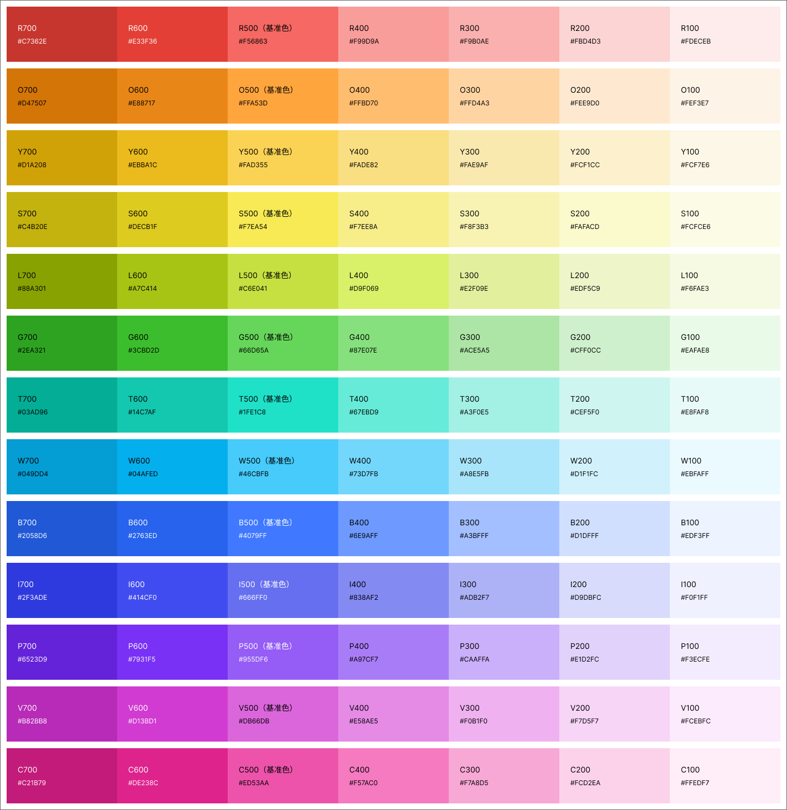

# tokenGen
打印JSON格式的样式token；渲染成 Guidelines





可修改的变量
```javascript

//行列翻转
const   isReverse   =   false;
//行数量
const   rows   =   13;
//调色盘的颜色
const   bgColor   =   'rgba(255, 255, 255, 1)';
//标题文本的颜色
const   txtColor   ='rgba(0,0,0,1)';
//对比度阈值（0-21）
const   contrastRatio   =   6;
//调色盘的名称
const   PaletteName   =   'palette-box';

```javascript